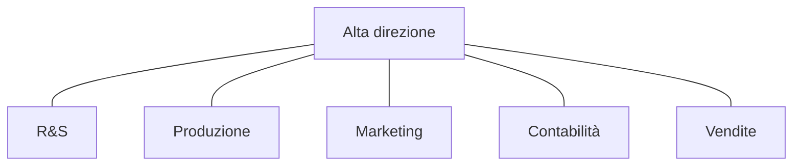
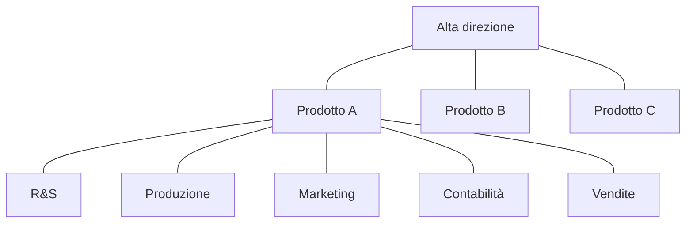

---
tags:
  - economia
---
# Organigramma
L'azienda ha una struttura gerarchica. $\to$ **Organigramma**
- Struttura funzionale

- Struttura divisionale

# Tipi di aziende
- Aziende di **produzione**: soddisfa i bisogni tramite la realizzazione di prodotti tangibili (mobili, abbigliamento, macchinari...).
- Aziende di **servizi**: soddisfa i bisogni tramite attività e erogazione di servizi (logistica, banca, posta...).
- Aziende **commerciali**: soddisfa i bisogni tramite attività di vendita/distribuzione di aziende di produzione.
# Aree funzionali
- **Produzione**: trasforma le materie prime in prodotti finiti.
- **Logistica**: movimento dei materiali
- **Ricerca e sviluppo**: creare nuovi prodotti e processi produttivi
- **Acquisti**: comprare materie prime, prodotti etc.
- **Amministrazione**: gestisce la parte economico-finanziaria.
- **Sistemi informativi**: gestione dell'hardware e del software aziendale.
- **Personale o Risorse umane**: gestione delle risorse umane occupandosi delle selezioni, sviluppo in azienda e formazione (più di 100 dipendenti).
- **Marketing**: soddisfare i bisogni dei consumatori, guadagnandoci sopra.