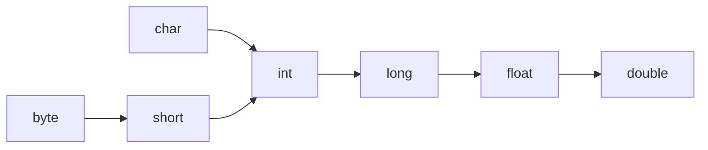
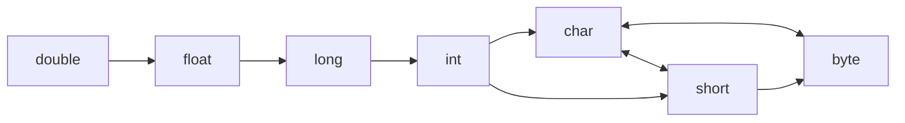

---
tags:
  - java
---
# Identificatori
Con identificatore ci riferiamo ai nomi dati alle entità (classi, metodi, pacchetti, variabili e costanti) in modo da poterle identificare in modo univoco.
**Regole** per scegliere il nome di un identificatore:
- Possono contenere solo lettere maiuscole, lettere minuscole, numeri, underscore e simbolo del dollaro.
- Non può iniziare con un numero.
- Non può appartenere alle parole riservate, ovvero le keyword (che vedremo di seguito).
- Non deve contenere spazi.
## Classi
Ogni programma Java deve essere scritto all'interno di una **classe**, poiché è uno dei principi principali della programmazione orientata agli oggetti. Questo è valido anche per semplici programmi procedurali, costituiti da una sola classe, come quelli che vedremo in questa lezione.
Il nome del **file** deve essere uguale al nome della **classe** che si vuole eseguire.
`StrutturaBase.java`
```java
public class StrutturaBase {
	public static void main(String[] args) {
		
	}
}
```
Per Java il **punto e virgola** segna la fine di un istruzione.
## Commenti
I commenti sono parti di testo ignorate dal compilatore, utili solo ai programmatori.
Modi per scrivere i commenti:
- su **una sola riga**: <code>//</code>.
- su **più righe**: da <code>/*</code> a <code>*/</code>.
- **documentazione**: da <code>/**</code> a <code>*/</code>.
Esempio:
```java
public class Commenti{
	public static void main(String[] args) {
	// Questo è un commento sulla singola riga
	
	/*
	Questo è
	un commento
	multiriga
	*/
	
	/**
	Questo è un commento
	di documentazione
	*/
	}
}
```
# Variabili
Le variabili sono contenitori utilizzati per memorizzare dati e permettere la manipolazione di essi durante l'esecuzione di un programma.
Per convenzione, i nomi delle variabili iniziano con una lettera minuscola; dunque, in caso di nome composto da più parole, seguono il formato **camelCase**.
## Dichiarazioni
Essendo Java un linguaggio a tipizzazione forte, prima di poter usare una variabile è necessario che essa venga dichiarata, ovvero che vengano fornite alcune informazioni descrittive di cui il compilatore necessita:
- un nome univoco;
- un tipo.
<code>tipoVariabile nomeVariabile</code>.
```java
public class DichiarazioneMultipla{
	public static void main(String[] args) {
	int caramelle, biscotti, cioccolatini;
	/*
	Corrisponde alla sequenza di istruzioni:
	int caramelle;
	int biscotti;
	int cioccolatini;
	*/
	}
}
```
## Inizializzazione
Una variabile che è stata dichiarata ma alla quale non sia ancora stato assegnato un valore è detta non inizializzata e contiene il valore di default del tipo di riferimento, che si vedrà di seguito.
Nonostante la presenza di valori di default, in molte occasioni il compilatore potrebbe dare errore nel caso in cui si stesse operando con una variabile **non inizializzata**. E’ dunque buona norma inizializzare le variabili al momento della dichiarazione, assegnandogli un valore inziale andando a combinare dichiarazione e assegnamento.
`ScambioVariabili.java`
```java
public class ScambioVariabili {  
    public static void main(String[] args) {  
        int a = 10, b = 9, c;  
        c = a;  
        a = b;  
        b = c;  
    }  
}
```
## Tipi
Java possiede due principali tipi di variabile:
- Tipi **primitivi**: tipi di dati non ulteriormente decomponibili.
- Tipi **di classe**: sono utilizzati per dati più complessi e rappresenta il tipo utilizzato per gli oggetti di una classe, sia per quelle che creeremo noi, sia per quelle già previste da Java. Di quest'ultimo tipo, tra i principali ricordiamo stringhe ed array.
Esempio:
```java
public class Tipi {
	public static void main(String[] args) {
		boolean oggiPiove = false;
		char classe = 'B';
		int votoJava = 28;
		double media = 21.54;
		/* Si osservi come la separazione tra parte decimale e intera viene
		fatta tramite il . e non la , */
	}
}
```
### Conversione di tipo
Proprio perché Java è un linguaggio fortemente tipizzato, un valore di un tipo non può essere memorizzato in una variabile di un altro tipo.
Quando si cerca di assegnare un valore di un tipo a una variabile di un tipo differente, deve prima essere effettuata una conversione (**casting**) dal tipo del valore a quello della variabile.
Ci sono quindi due tipi di casting:
- [[#Casting implicito|Implicito]]: avviene in modo automatico da parte del compilatore in caso di conversioni **lossless**.
- [[#Casting esplicito|Esplicito]]: deve essere svolto manualmente dal programmatore in caso di conversioni **lossy**.
#### Casting implicito
Si può fare solo se il tipo di variabile di destinazione è **più preciso**.
Questo scherma rappresenta il casting implicito che si può fare per valori di **tipo numerico**:

#### Casting esplicito
Si può fare solo se il tipo di variabile di destinazione è **meno preciso**.

Le conversioni possono avvenire in modo particolare per gestire la perdita di contenuto informativo; nel semplice e comune caso di conversione da un tipo in virgola mobile a uno intero, semplicemente viene troncata la parte decimale.
`castingEsplicito.java`
```java
public class CastingEsplicito {
	public static void main(String[] args) {
		int caramelle = 180;
		byte caramelleByte = (byte) caramelle;
		//caramelleByte vale -76
		
		double prezzo = 0.89;
		int prezzoInt = (int) prezzo;
		//prezzoInt vale 0
		
		int numero = 99;
		char numeroChar = (char) numero;
		//numeroChar vale 'c'
	}
}
```
### Costanti
Se mettiamo `final` prima di una variabile dichiariamo che quest'ultima è una costante.
```java
public class CastingEsplicito {
	public static void main(String[] args) {
		final double PI = 3.14159;
		final int GIORNI_DELLA_SETTIMANA = 7;
		/* L'istruzione
		PI = 4;
		Genererebbe un'errore.
	}
}
```
## Scope
Le variabili non sono visibili, e quindi utilizzabili, ovunque. La porzione di codice in cui è disponibile un identificatore resta associato a un indirizzo di memoria è detto visibilità (scope) della variabile.
Una variabile è visibile solo all'interno del blocco di codice in cui è stata dichiarata, inclusi i blocchi annidati all'interno: questo avviene perché, una volta terminato il blocco, il compilatore libera automaticamente gli indirizzi di memoria relativi.
Per questioni di pulizia del codice e per evitare errori relativi allo scope e alla dichiarazione, è consigliabile dichiarare tutte le variabili all’interno del metodo main e prima delle istruzioni che
compongono il programma.
## Schema PIPO
La maggior parte delle applicazioni segue lo schema PIPO:
- **Preparare**: dichiarare le variabili e spiegare il programma all'utente.
- **Input**: fai inserire dall'utente i dati all'ingresso.
- **Processare**: eseguire le attività che compongono l'algoritmo.
- **Output**: mostrare all'utente i dati prodotti.
E' dunque necessario riuscire a interagire con l'utente: questo viene fatto tramite istruzioni di output su schermo (in cui si devono produrre messaggi chiari, ben formati e grammaticalmente corretti) e di input da tastiera.
# I/O
## Output a schermo
Per eseguire l'output a schermo in Java occorre utilizzare classi, oggetti e metodi: in seguito approfondiremo questa concezione, per il momento è sufficiente sapere che l'istruzione `System.out.println( )` consente di stampare a schermo ciò che viene riportato tra le parentesi sottoforma di **stringa**.
**Esempio** di sintassi: `System.out.println(valoreDaStampare);`
System è una classe della Java Class Library, già **presente di default** e quindi non vi è la necessità di importarla.
Utilizzando `println( )`, una volta stampato ciò che viene riportato tra parentesi, viene inserito automaticamente un simbolo di terminazione di riga, dunque il cursore viene spostato all'inizio della riga successiva, dalla quale partirà la stampa successiva.
Se vogliamo stampare a video senza andare a capo, utilizziamo `System.out.print( )`.
**Nota**: si può usare `println( )` senza niente dentro (per inserire una riga vuota), ma non `print( )`.
**Esempio**:
```java
public class StampaPrint {
	public static void main(String[] args) {
		System.out.print(1);
		System.out.print(2);
		System.out.println();
		System.out.print(3);
		System.out.print(4);
	}
}
```

![[02.1 - Esercizi#Esercizio Output e Casting|Esercizio]]
## Input da tastiera
Per quanto riguarda l'input da tastiera, Java mette a disposizione diverse possibilità per gestirlo, noi vedremo quello che fa uso della **classe Scanner**
Bisogna quindi **importare** la classe Scanner: `import java.util.Scanner;`. 
A questo punto occorre creare un oggetto della classe Scanner:
```java
Scanner nomeOggettoScanner = new Scanner(System.in);`
```
Tale oggetto si potrà ora utilizzare per richiamare i metodi della classe Scanner che consentono di leggere i dati inseriti dalla tastiera. I principali sono:
- `nomeOggettoScanner.next()`: restituisce il successivo input da tastiera fino al primo carattere di delimitazione (di default, lo spazio) sotto forma di stringa.
- `nomeOggettoScanner.nextLine()`: restituisce il successivo input da tastiera fino al primo carattere di terminazione di riga sottoforma di stringa. Il carattere finale \n di fine riga viene letto e scartato.
- `nomeOggettoScanner.nextInt()`: restituisce il successivo input da tastiera come valore di tipo int.
- `nextDouble, nextFloat, nextLong, nextByte, nextShort, nextBoolean` consentono di leggere un valore del tipo corrispondente e vengono richiamati nello stesso modo di `nextInt()`.
**Esempio**:
```java
import java.util.Scanner;
public class InputScanner {
	public static void main(String[] args) {
		String parola, frase;
		int numero;
		Scanner tastiera = new Scanner(System.in);
		frase = tastiera.nextLine( );
		parola = tastiera.next( );
		numero = tastiera.nextInt();
		System.out.println(frase);
		System.out.println(parola);
		System.out.println(numero);
		tastiera.close( );
	}
}
```

![[02.1 - Esercizi#Esercizio Input|Esercizio]]
# Stringhe
Una stringa è una sequenza finita di caratteri alfanumerici rappresentati tramite codifica Unicode UTF-16: essa può dunque essere vista come un array (di cui parleremo in seguito) di valori char.
Proprio per questo, le stringhe in Java non sono di tipo primitivo, bensì un tipo della classe String, per la precisione `java.lang.String`.
Esistono diversi metodi per gestire le stringhe in Java, ma noi seguiremo il più semplice: la dichiarazione e l'inizializzazione di una variabile di tipo String segue la medesima sintassi di quella usata per i tipi primitivi: `String nomeVariabile = espressione;`
Per convertire un valore da un tipo primitivo a un valore stringa, si utilizza il metodo `valueOf()`:
```java
variabileStringa = String.valueOf(valorePrimitivo);
```
In Java, le stringhe vengono gestite dallo **String pool**, un'area della memoria Heap in cui vengono salvate i letterali di tipo stringa con lo scopo di ottimizzare la gestione di essi:
- Quando si vuole utilizzare un letterale di tipo String, la JVM controlla nello String pool.
- Se nello String pool quella stringa non viene trovata, essa viene inserita e la variabile avrà un riferimento a tale indirizzo di memoria.
- Se nello String pool quella stringa viene trovata, la stringa non viene salvata nuovamente in memoria, bensì la variabile avrà un riferimento all'indirizzo di memoria in cui la stringa già si trovava.
Le stringhe sono **immutabili**: questo significa che anche in caso il loro valore venisse alterato, questo non verrebbe modificato ma creerebbe una nuova stringa e si ripeterà nuovamente il funzionamento dello String pool.
## Caratteri di escape
I caratteri di escape sono caratteri speciali preceduti dal backslash:
- `\"` corrisponde all'apice doppio.
- `\'` corrisponde all'apice singolo.
- `\\` corrisponde alla backslash.
- `\n` corrisponde all'andare a capo.
- `\t` corrisponde all'aggiungere una tabulazione.
**Esempio**:
```java
public class Escape {
	public static void main(String[] args) {
		System.out.println("Il termine \"Java\" non è \n stato \t trovato!");
	}
}
```
![[02.1 - Esercizi#Esercizio Caratteri di Escape]]