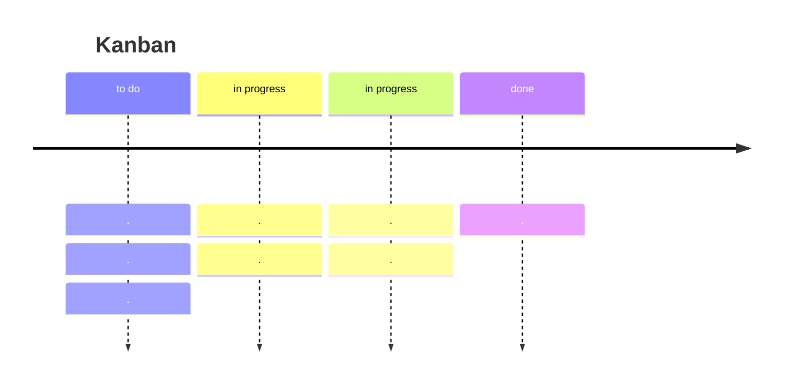

---
tags:
  - PM
---
Il [Manifesto Agile](https://agilemanifesto.org/principles.html) elenca i principi del metodo Agile:
```
- La nostra massima priorità è soddisfare il cliente attraverso la consegna tempestiva e continua di software di valore.
- Accogliere i requisiti che cambiano, anche tardivamente nello sviluppo. I processi agili sfruttano il cambiamento a vantaggio competitivo del cliente.
- Consegnare frequentemente software funzionante, da un paio di settimane a un paio di mesi, con una preferenza per il periodo più breve.
- Le persone del settore commerciale e gli sviluppatori devono lavorare insieme quotidianamente per tutta la durata del progetto.
- Costruire progetti attorno a individui motivati.
- Fornire loro l'ambiente e il supporto di cui hanno bisogno e fidarsi di loro per fare il lavoro.
- Il metodo più efficiente ed efficace per trasmettere informazioni al team di sviluppo è la conversazione faccia a faccia.
- Il software funzionante è la misura primaria del progresso.
- I processi agili promuovono lo sviluppo sostenibile.
- Gli sponsor, gli sviluppatori e gli utenti dovrebbero essere in grado di mantenere un ritmo costante indefinitamente.
- L'attenzione continua all'eccellenza tecnica e al buon design migliora l'agilità.
- La semplicità, l'arte di massimizzare la quantità di lavoro non fatto, è essenziale.
- Le migliori architetture, requisiti e progetti emergono da team auto-organizzanti.
- A intervalli regolari, il team riflette su come diventare più efficace, quindi sintonizza e adatta il suo comportamento di conseguenza.
```

**Circolo di Zorro**:
"Di base, la fiducia parte dal centro di un cerchio (zero). Con varie azioni si può costruire fiducia, se si sbaglia si riparte da zero".
Una teoria opposta vuole che si parte dal 100% della fiducia $\to$ si può solo peggiorare, sta a te mantenere quella fiducia.
Nella maggior parte dei casi lavorativi, si applica il circolo di Zorro.

Nel punto 10, quando si parla di lavoro non svolto, si intende di eliminare tutto il lavoro non necessario.

