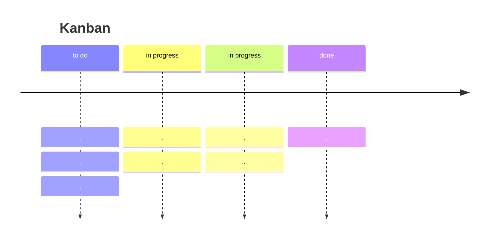

---
tags:
  - PM
---
Il [Manifesto Agile](https://agilemanifesto.org/principles.html) elenca i principi del metodo Agile:
```
1. La nostra massima priorità è soddisfare il cliente
attraverso la consegna tempestiva e continua
di software di valore.

2. Accogliamo con favore i requisiti che cambiano, anche in
sviluppo. I processi agile sfruttano il cambiamento per
vantaggio competitivo del cliente.

3. Consegnare software funzionante frequentemente, da un
settimane a un paio di mesi, con una
preferenza per i tempi più brevi.

4. I responsabili aziendali e gli sviluppatori devono lavorare
sviluppatori devono collaborare quotidianamente per tutta la durata del progetto.

5. Costruite i progetti attorno a persone motivate.
Offrite loro l'ambiente e il supporto di cui hanno bisogno,
e fidatevi di loro per portare a termine il lavoro.

6. Il metodo più efficiente ed efficace per
informazioni a e all'interno di un team di sviluppo è la conversazione
team di sviluppo è la conversazione faccia a faccia.

7. Il software funzionante è la misura principale del progresso.

8. I processi agile promuovono uno sviluppo sostenibile.
Gli sponsor, gli sviluppatori e gli utenti dovrebbero essere in grado di
di mantenere un ritmo costante all'infinito.

9. L'attenzione continua all'eccellenza tecnica
e alla buona progettazione migliora l'agilità.

10. La semplicità, ovvero l'arte di massimizzare la quantità di lavoro non
di lavoro non svolto, è essenziale.

11. Le migliori architetture, requisiti e progetti
emergono da team auto-organizzati.

12. A intervalli regolari, il team riflette su come
diventare più efficace, quindi mette a punto e aggiusta il suo
il suo comportamento di conseguenza.
```

**Circolo di Zorro**:
"DI base, la fiducia parte dal centro di un cerchio (zero). Con varie azioni si può costruire fiducia, se si sbaglia si riparte da zero".
Una teoria opposta vuole che si parte dal 100% della fiducia $\to$ si può solo peggiorare, sta a te mantenere quella fiducia.
Nella maggior parte dei casi lavorativi, si applica il circolo di Zorro.

Nel punto 10, quando si parla di lavoro non svolto, si intende di eliminare tutto il lavoro non necessario.

