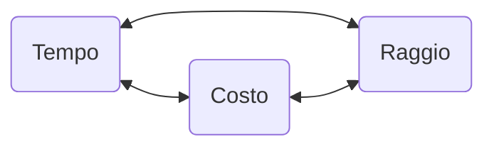
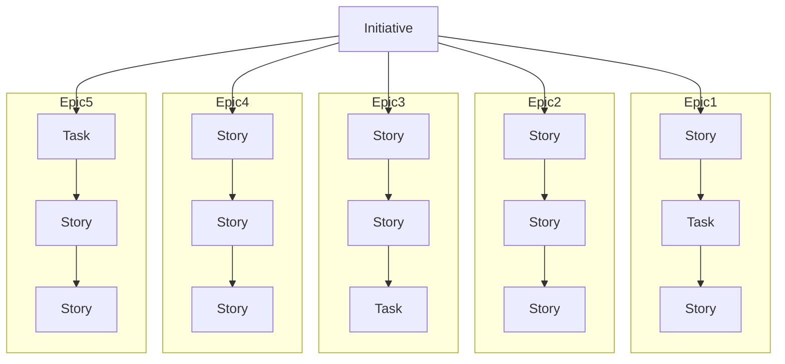
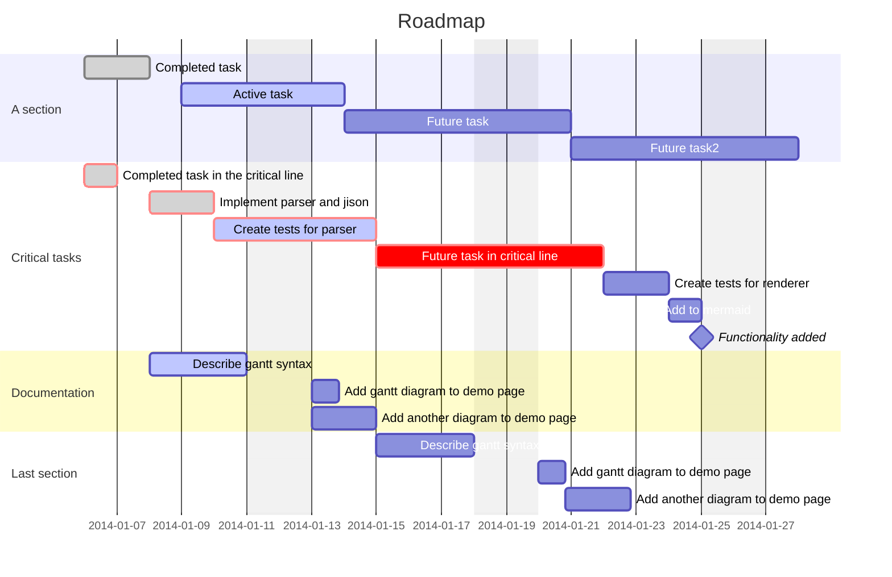

---
tags:
  - PM
---


1. Iniziare con una [[#Idea di alto livello|idea di alto livello]];
2. [[#Identificazione Epic|Identificare le macro attività (Epic)]];
3. Realizzare una [[#WBS delle Epic in Story|WBS (Work Breakdown Structure) delle Epic in Story]];
4. [[#Fornire le stime]];
5. [[#Realizzare una roadmap]];
6. [[#Condividere, revisionare migliorare|Condividere con il team e validare;]]
7. [[#Condividere, revisionare migliorare|Revisionare e migliorare]].
## Idea di alto livello
Idea generale sul piano/progetto da sviluppare. Informazioni generiche.
In un contesto aziendale Agile, ogni progetto potrebbe rientrare in un preciso “Tema”.
Un **tema** è una grande area con elementi in comune, che aiuta i team Agile a tenere sotto controllo gli obiettivi aziendali.
## Identificazione Epic
**Epic**: macro-aree.
Un epic Agile è una porzione di lavoro che può essere suddivisa in task specifici (chiamati storie utente) in base alle esigenze/richieste dei clienti o degli utenti finali.
Approccio Top to Bottom.
**Esempio**:
```
Progetto:
Aggiornamento delle regole di sicurezza

Epic:
- Miglioramento della sicurezza degli account personali
- Aggiornamento delle policy aziendali
- Cambio di provider di posta elettronica
- Aggiornamento dei software dei server all’ultima versione
```
## Definire le release
Definire le **release intermedie**, consente di avere delle “**Milestone**” da inserire nella pianificazione, per supportare lo sviluppo e il raggiungimento di obiettivi.
Avere delle Milestone intermedie consente inoltre un maggiore controllo dello stato del progetto.
**Milestone**: "un punto nel tempo". Di solito coincide con la chiusura di una release.
## WBS delle Epic in Story
**WBS**: Work Breakdown Structure.
Ogni Epic viene spezzettata in tante piccole Story.
**User Story**: Una storia utente è una spiegazione informale e generale di una funzione del software scritta dalla prospettiva dell'utente finale. Il suo scopo consiste nello spiegare in che modo la funzione del software è in grado di fornire valore al cliente.
Solitamente si segue un **template**.
**Esempio**:
```
Epic:
- Miglioramento della sicurezza degli account personali
- Aggiornamento delle policy aziendali
- Cambio di provider di posta elettronica
- Aggiornamento dei software dei server all’ultima versione

Story:
- Miglioramento della sicurezza degli account personali
- Come azienda, voglio che i dipendenti facciano il login ai sistemi aziendali tramite una doppia autenticazione, per essere sicuri che siano loro ad effettuare l’accesso.
- Come azienda, voglio che l’account dei dipendenti effettui il log-out automatico dopo 30 min, per evitare che sessioni prolungate aumentino il rischio di frode.
```


## Fornire le stime
Gli **Story Points** sono unità di misura (variabili) per esprimere una stima dello sforzo complessivo richiesto per implementare completamente un articolo o qualsiasi altro lavoro.
**Esempio**:
```
Siamo una azienda di veicoli e misuriamo lo sforzo in Story Points tramite la sequenza di Fibonacci.

Skateboard: 0;
Triciclo: 1;
Bicicletta: 2;
Scooter: 3;
Macchina: 5;
Bus: 8;
Camion: 13:;
Treno: 21;
```

| Story ID | Story                                                                                                                                                                               | Estimate (Story Points) |
|----------|-------------------------------------------------------------------------------------------------------------------------------------------------------------------------------------|-------------------------|
| ARS-S-1  | Come azienda, voglio che i dipendenti facciano effettuino il login ai sistemi aziendali tramite una doppia autenticazione, per essere sicuri che siano loro ad effettuare l’accesso | 13                      |
| ARS-S-2  | Come azienda, voglio che l’account dei dipendenti effettui il log-out automatico dopo 30 min, per evitare che sessioni prolungate aumentino il rischio di frode                     | 8                       |

## Realizzare una roadmap
Ogni singola user story deve essere proposta al team, il quale fornisce una stima.
Solitamente una roadmap viene rappresentata con un Gantt.

![[Roadmap.png]]
Il totale degli story point / la velocità del team = la data di fine progetto stimata.
**Velocity Chart**:
![[VelocityChart.png]]
## Condividere, revisionare migliorare
In un team Agile, è **fondamentale** condividere i piani con il team di lavoro, per assicurarsi che la roadmap, il piano di progetto, lo sprint, siano sempre chiari e trasparenti verso il team stesso.