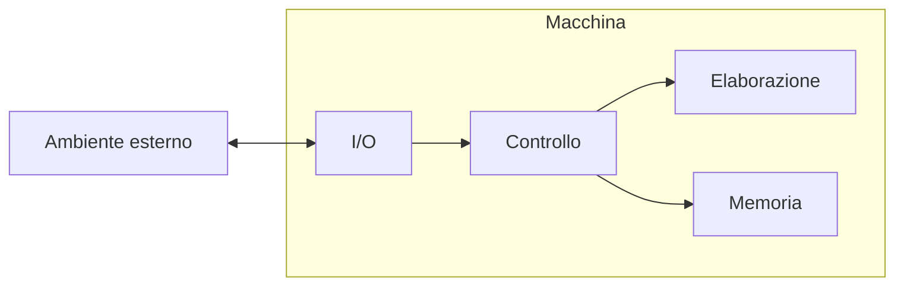
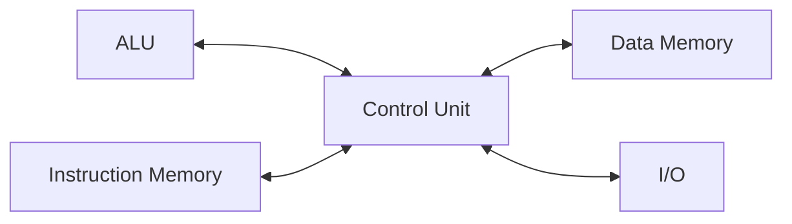
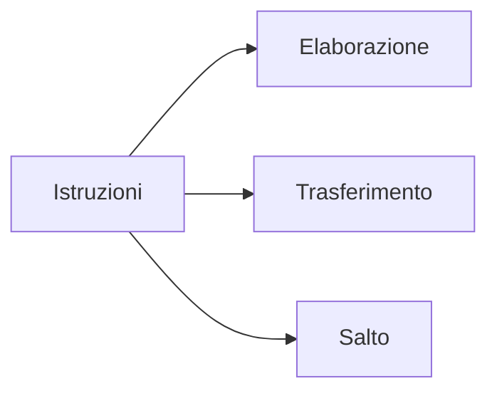

---
tags:
  - OS
---
Il [[02.1 - Sistema Operativo|sistema operativo]] è un software che fornisce delle funzionalità all'utente, **astraendo** dall'hardware sottostante.
## Computer
Un computer è un un dispositivo in grado di:
- Elaborare dati;
- Memorizzare dati;
- Trasferire dati da e verso l'esterno;
- Eseguire operazioni di controllo e coordinamento tra le parti di cui è composto.

La memoria, storicamente, viene conservata nei _Flip Flop_, ma solo temporaneamente.
Il processore è fatto da silicio, di solito è composto da miliardi di transistor.
Memoria:
- statica: veloce ma con poca capacità,
- dinamica: fatta da un condensatore, lenta ma con molta capacità.
Tipicamente i computer hanno un compromesso tra memoria statica e dinamica.
Per la **legge di Joule**, un circuito scambia in modo proporzionale alla corrente trasmessa.
La memoria statica può avere più livelli a seconda della velocità: L1, L2, L3...
### Architettura Harvard
Architettura più veloce ma più costosa, per questo viene favorita l'architettura di Von Neumann, che costa meno.

## Architettura di Von Neumann
Dati e programmi sono rappresentati allo stesso modo (da sequenze di bit) e contenuti nella stessa memoria.
![[VonNeumann.png]]

Gli **elementi principali** della macchina di Von Neumann sono:
- [[#La CPU|CPU]] o Unità di elaborazione:
	- Elabora dati, coordina trasferimento dei dati
	- Esegue i programmi, cioè interpreta ed esegue le loro istruzioni
- [[#Memoria Centrale]]:
	- Memorizza dati e programmi in esecuzione
	- Capacità limitata (volatile, accesso all’informazione molto rapido)
- Memoria secondaria/di massa:
	- Memorizza grandi quantità di dati e programmi
	- Persistente
	- Accesso molto meno rapido della memoria centrale
- Unità periferiche (I/O):
	- Comunicazione con l’ambiente esterno
	- Tastiera, mouse, video, altoparlanti, stampanti
	- L’ambiente esterno non è sempre un utente umano (impianti industriali, robot, strumenti di controllo)
- Bus di sistema:
	- Insieme di fili di rame che collegano tutti i componenti del sistema e consente lo scambio di dati
### Memoria Centrale
La memoria centrale contiene le informazioni su cui la CPU sta operando, cioè sia i dati che le istruzioni dei programmi. Tutta l’informazione, per poter essere elaborata, deve passare dalla memoria centrale (e successivamente caricata in uno dei registri della CPU).
Le dimensioni medie della memoria centrale sono nell'ordine dei Gigabyte, con tempi di accesso attorno ai nanosecondi. Ricorda inoltre che questa memoria è **volatile**: se si spegne la macchina si perdono i dati.

Rispetto alla memoria di massa, la memoria centrale è molto più piccola e veloce.
La memoria è organizzata come una **tabella**:
- Ogni riga è detta cella e può contenere una parola
- Una parola è una sequenza di n bit
- Tutte le celle sono della stessa lunghezza (8, 16,32, 64 bit)
- La posizione di una cella è identificata da un indirizzo

Esistono due specifici registri per comunicare con la memoria:
- Registro indirizzi (AR) di dimensioni k (permette di specificare 2k indirizzi)
- Registro dati (DR) di dimensione pari a quella della cella

Si possono eseguire due sole operazioni:
- **Load**: copia il contenuto della cella il cui indirizzo è specificato nel registro AR nel registro DR
- **Store**: copia il contenuto del registro DR nella cella di memoria il cui indirizzo è specificato nel registro AR
![[MemoriaCentrale.png]]
Little endian: il bit più significativo passa per primo (La maggior parte dei computer);
Big endian: il bit più significativo passa per ultimo (Internet).

La memoria centrale è realizzata con una tecnologia chiamata RAM (Random Access Memory):
- È realizzata mediante circuiti a transistor
- È modificabile (leggibile e scrivibile) ma deve essere continuamente alimentata per mantenere le informazioni (volatile)
- All’accensione il suo contenuto è una sequenza casuale di 0 e 1
- Le celle sono indirizzabili in un ordine qualunque (accesso random = diretto)
- Il tempo di accesso non dipende dalla cella

Nel computer è presente anche un’altra memoria detta ROM (Read-Only Memory):
- È solo leggibile: le informazioni sono di solito scritte in modo permanente dal costruttore
- È caricata al momento della produzione del calcolatore
- Vi si accede ogni qualvolta questo viene acceso
- Per programmi protetti e definiti dal costruttore • Il BIOS (Basic I/O System) che carica in memoria il [[02.1 - Sistema Operativo|sistema operativo]] quando la macchina viene accesa
- Esistono di diversi tipi • “Erasable”, “Programmable”, (EPROM) • Memorie flash (evoluzione delle EPROM) • Una via intermedia tra Hardware e Software (Firmware)
Il **firmware** è un software che contiene la parte di avvio (bios) e una serie di funzionalità presenti nei sistemi operativi (senza aver bisogno di installare un [[02.1 - Sistema Operativo|sistema operativo]] completo).
### La CPU
La CPU contiene gli **elementi circuitali** che regolano il funzionamento del calcolatore:
- L’unità di controllo è responsabile della decodifica e dell’esecuzione delle istruzioni. È la parte che “dirige” l’esecuzione di tutte le altre parti
- L’orologio di sistema (clock) permette di sincronizzare le operazioni temporizzando il funzionamento del calcolatore
- L’unità aritmetico-logica (ALU) realizza le operazioni aritmetiche e logiche eventualmente richieste per l’esecuzione dell’istruzione. È priva di facoltà di scelta
- I registri sono piccole memorie velocemente accessibili, utilizzate per memorizzare risultati parziali o informazioni necessarie al controllo. L’insieme dei valori contenuti nell'insieme di tutti i registri in un dato istante dell’elaborazione viene chiamato contesto

I **registri** della CPU:
- Registro contatore di programma (PC) contiene l’indirizzo di memoria della prossima istruzione da eseguire
- Registro istruzione corrente (CIR) contiene l’istruzione correntemente in esecuzione
- Registri operandi (A, B) contiene gli operando su cui eseguire la prossima operazione con la ALU
- Registri di lavoro contengono i dati utilizzati di frequente nelle operazioni o risultati intermedi (in genere i registri operandi e i registri di lavoro sono stati uniti in un’unica struttura contenente una serie di registri chiamato banco di registri)
- Registro di stato (SR) contiene alcune informazioni sull’esecuzione dell’ultima operazione della ALU (bit di overflow, bit di segno, bit zero)
- Registro indirizzi (AR) contiene un indirizzo di memoria in cui fare un’operazione di lettura/scrittura
- Registro dati (DR) contiene un dato da trasferire alla memoria o ricevuto dalla memoria
- Registro interruzioni (INTR) contiene informazioni sullo stato di funzionamento delle periferiche
**Interrupt**: generazione di un segnale elettrico sul bus di controllo: si alza un flip flop che avvisa il processore di una richiesta pendente. La risposta is chiama _interrupt acknowledge_.
**NMI** (Non Maskable Interrupt): interrupt non mascherabile $\to$ ES: eventi hardware.
## Formato delle istruzioni in linguaggio macchina
Le istruzioni in linguaggio macchina sono costituite da sequenze di 0 e 1, divise in campi:
- Codice operativo (OPCODE): specifica l'istruzione da seguire
- Operandi: indicano i dati da utilizzare

La CPU esegue ciclicamente queste **tre fasi**:
- **Fetch**:
	- Contenuto di registro PC trasferito in registro AR
	- Lettura da memoria centrale trasferito in registro DR
	- Contenuto del registro DR trasferito in registro CIR
	- Incremento del contenuto di registro PC
- **Decode**: interpretazione del codice operativo
- **Execute**: esecuzione del codice letto

### Bus di sistema
Il Bus di sistema è un insieme di connettori (conduttori elettrici id rame) che trasportano bit di informazioni collegando fra di loro l’unità di elaborazione, la memoria e le varie interfacce di ingresso/uscita.
I trasferimenti sono gestiti dalla CPU(modalità master/slave) e si chiamano cicli del bus, che con la sua capacità ne determina la velocità.
Il Bus di sistema è diviso in tre bus:
- **Bus Dati**: trasferisce dati da master a slave e viceversa
- **Bus Indirizzi**: trasferisce indirizzi, per esempio l’indirizzo di un dato dal registro indirizzi alla memoria, per accedere al dato stesso
- **Bus di Controllo**: Read/Write, Errore, Richiesta e risposta (lavoro eseguito), Memoria o I/O
![[BusDiSistema.png]]

Operazione di lettura da memoria centrale (**LOAD**):
1) a CPU carica l’indirizzo della parola di memoria nel registro AR e lo trasmette alla memoria via bus indirizzi
2) la CPU invia il comando di Read Memory sul bus di controllo
3) la memoria trasmette sul bus dati il contenuto della parola verso il registro DR
4) la memoria segnala al processore sul bus di controllo che l’operazione è stata completata con successo: il dato si trova nel registro dati

Operazione di scrittura in memoria centrale (**STORE**):
1) La CPU carica indirizzo della parola di memoria dove si vuole scrivere nel registro AR e lo trasmette alla memoria via bus indirizzi
2) La CPU carica nel registro DR la parola da scrivere in memoria e tramite il bus dati il valore viene trasmesso alla memoria
3) La CPU invia il comando di Write Memory sul bus di controllo
4) La memoria esegue l’operazione di scrittura del valore ricevuto sul bus dati all’indirizzo di memoria segnalato
5) La memoria segnala al processore sul bus di controllo che l’operazione è stata completata con successo: il dato si trova nella parola di memoria destinazione.

In un sistema IA32 la memoria è divisa in fette, grandi tipicamente 4K. Quando la macchina tenta di andare ad un indirizzo logico, viene mandata ad un indirizzo fisico.
Un programma NON può accedere allo spazio in ram di un altro programma per design hardware (motivi di sicurezza).