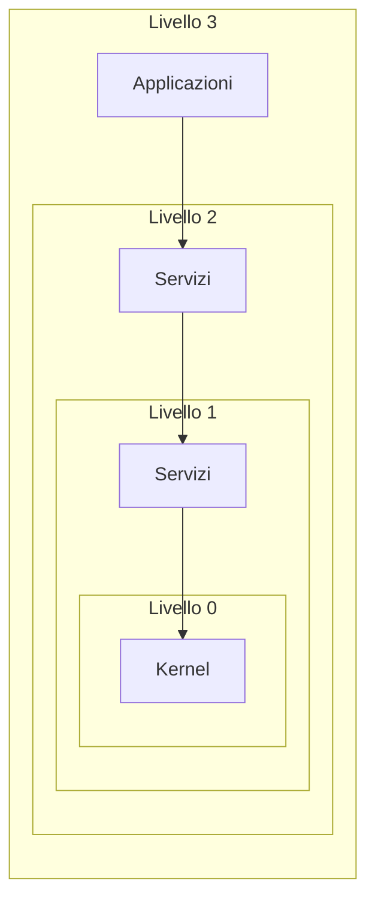
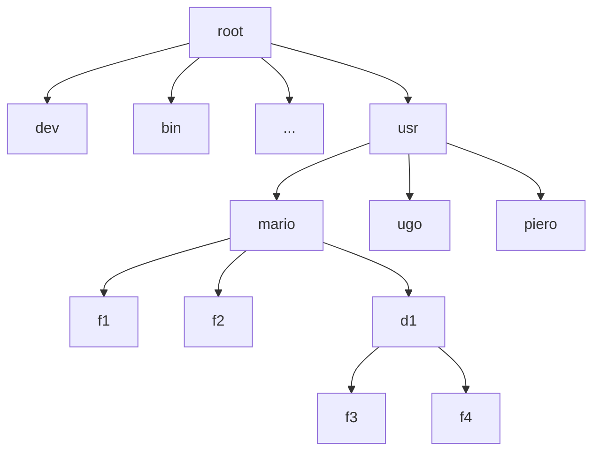
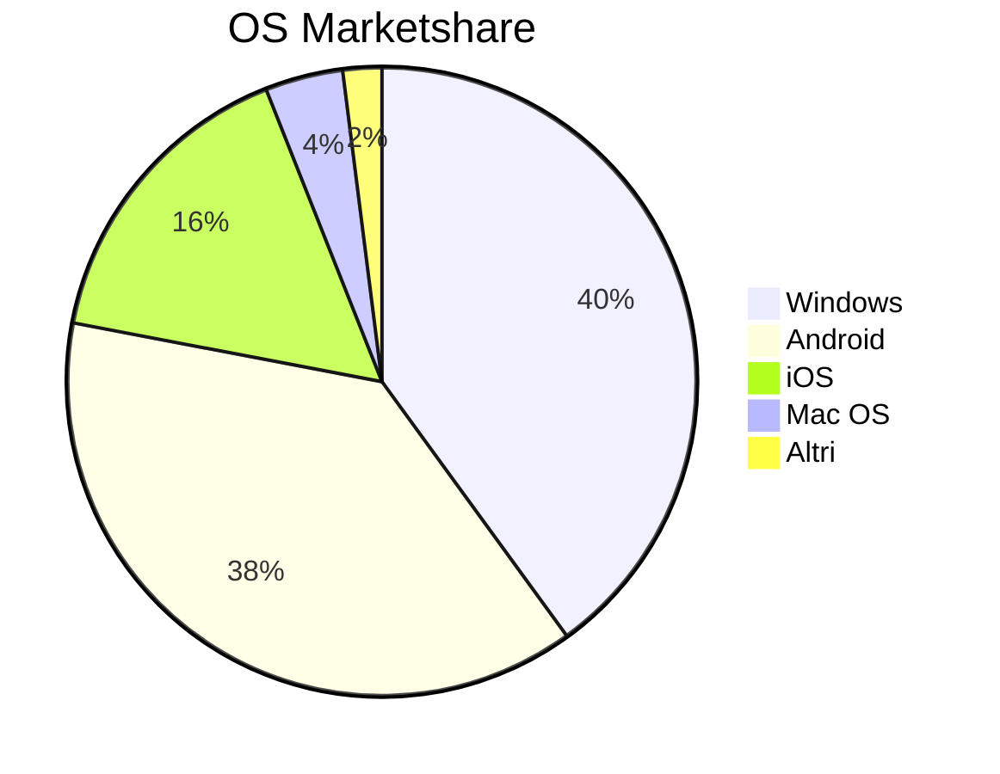

---
tags:
  - OS
---
Il Sistema Operativo **(SO)**:
- è uno strato software che nasconde agli utenti i dettagli dell’architettura hardware del calcolatore;
- fornisce diverse funzionalità ad alto livello che facilitano l’accesso alle risorse del calcolatore,
- supporta l’esecuzione dei programmi applicativi definendo una _macchina virtuale_, cioè un modello ideale del calcolatore, sollevando il software applicativo dal compito di gestire i limiti delle risorse disponibili,

Per motivi di sicurezza, i sistemi operativi sono divisi in **livelli**:

## Eccezioni
Un evento hardware che riportano un malfunzionamento della macchina.
Eccezioni del sistema operativo:
- **Fault**: non recuperabile;
- **Traps**: recuperabili in alcuni casi;
- **Aborts**: si termina il programma, ma il sistema operativo continua a girare correttamente.

## Tipi di SO
Esistono diversi tipi di sistema operativo, ma in generale si possono dividere in:
- Monoutente e monoprogrammato:
	- Esecuzione un solo programma applicativo alla volta
	- Viene utilizzato da un solo utente per volta
	- Esempio: DOS
- Monoutente e multiprogrammato (multitasking):
	- Consente di eseguire contemporaneamente più programmi applicativi
	- Esempio: Windows 10, il sistema operativo di uno smartphone
- Multiutente (e multiprogrammato):
	- Consente l’utilizzo contemporaneo da parte di più utenti 
	- E’ inerentemente multiprogrammato
	- Esempi: Linux, Mac OS X, Windows NT (server)

Il SO è tipicamente organizzato a strati, ciascun strato costituisce una macchina virtuale che gestisce una risorsa del calcolatore:

|      Programmi Utente      |
|:--------------------------:|
|     Interprete comandi     |
|        File system         |
| **Gestione delle periferiche** |
|   **gestione della memoria**   |
|   **Gestione dei processi**    |
|      Macchina fisica       |
Gli strati che vanno dalla gestione delle periferiche alla gestione dei processi sono indispensabili per il funzionamento del sistema operativo (kernel). 
## Gestione dei processi
La CPU del calcolatore deve essere distribuita in maniera opportuna fra i programmi da eseguire.
Il gestore dei processi mette a disposizione di ogni programma in esecuzione una macchina virtuale che ne consente l’esecuzione come se la CPU del calcolatore fosse interamente dedicata a esso.
Scheduling: il gestore dei processi assegna una _"time slice"_ ad ogni programma da eseguire (ES: 20ms per ogni programma), così sembra che tutti i processi vengano eseguiti in contemporanea.
## Gestione della memoria
La gestione concorrente di molti programmi applicativi comporta la presenza di molti programmi in memoria centrale.
Il SO offre a ogni programma applicativo la visione di una memoria virtuale, che può avere dimensioni maggiori di quella fisica.
Per gestire la memoria virtuale il SO dispone di diversi meccanismi:
- Rilocazione
- Paginazione
- Segmentazione
## Gestione delle periferiche
Sono meccanismi software a cui è affidato il compito di trasferire dati da e verso le periferiche.
Consentono ai programmi applicativi di leggere o scrivere i dati con primitive di alto livello che nascondono la struttura fisica delle periferiche (ES: nel sistema Unix le periferiche sono viste come file speciali).
## Gestione del File System
Il SO si occupa di gestire i file sulla memoria di massa:
- Creare un file
- Dargli un nome
- Collocarlo in un opportuno spazio nella memoria di massa
- Accedervi in lettura e scrittura
Gestione dei file indipendente dalle caratteristiche fisiche della memoria di massa.
I file vengono inclusi all’interno di directory (o cartelle, o cataloghi). Queste ultime, in genere, le directory sono organizzate ad albero.
## Organizzazione dei file
A ciascun utente è normalmente associata una directory specifica, detta _home directory_.
Il livello di protezione di un file indica quali operazioni possono essere eseguite da ciascun utente.
Ciascun file ha un _pathname_ (o nome completo) che include l’intero cammino dalla radice dell’albero.
Il contesto di un utente all’interno del file system è la directory in cui correntemente si trova.

## Tipi di SO
Ci sono vari tipi di sistemi operativi:
- Batch OS (elaborazione a lotti)
- Multitasking
- Multiprocessing
- Real Time OS: esegue le istruzioni in un tempo compatibile per cui queste sono state pensate
- Distributed OS
- Network OS
- Mobile OS

## Kernel
**Capacità del kernel**:
- organizzazione dei processi a basso livello
- comunicazione tra processi
- sincronizzazione tra processi
- cambio di contesto
### Tipi di kernel
Monolitico: blocco unico di codice, un unico programma eseguibile che si occupa di tutte le funzioni del sistema operativo (ES: vecchie versioni di linux).
Microkernel: kernel molto piccolo che si occupa delle risorse a livello più basso della macchina.