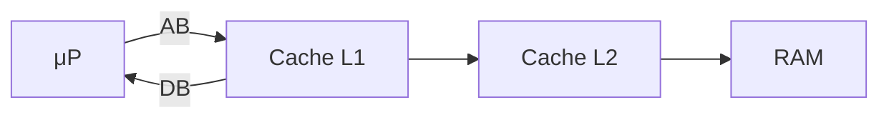

---
tags:
  - OS
---
# Polling
Un gigantesco "ciclo":
- chiedi
- dato presente?
- leggi
- passa al prossimo dispositivo
- ripeti
è facile da implementare ma altamente inefficiente.
# Task
La CPU esegue i task/job, viene interrotta e, nel caso, legge la periferica "Handler"
La periferica interrupt scrive il proprio ID al [[02 - Computer e Sistema Operativo#Bus di sistema|bus dei dati]]. Il segnale di acknowledge scatta per segnalare che la CPU riconosce la periferica.
I driver contengono i codici per riconoscere l'interruzione.
# DMA
DMA (Direct Memory Access)
![[DMA.png]]
Dopo aver impostato buffer, puntatori e contatori per il dispositivo I/O, il controllore del dispositivo trasferisce un intero blocco di dati direttamente al dispositivo e dalla memoria principale, senza intervento da parte della CPU. Per ogni blocco viene generata una sola interruzione, per dire al driver del dispositivo che l'operazione è stata completata, piuttosto che una per byte generata per i dispositivi a bassa velocità.
Ogni cavo di rete ha 4 coppie di cavi (chiamate doppini).
Il problema in questo caso è che il processore non può accedere al bus durante il DMA.
La cache torna molto utile per evitare rallentamenti, immagazzinando indirizzi utili per le chiamate.
# Multicore
Sulla motherboard si possono tenere più processori (ovviamente le motherboard devono supportarlo). La soluzione più efficiente è avere una sola CPU con più core.
![[multicore.png]]

**SATA** = Serial Attached Transfer Architecture
**PCI** = Peripheral Connect Interface
**NUMA** = Non Uniform Memory Access
![[numa.png]]