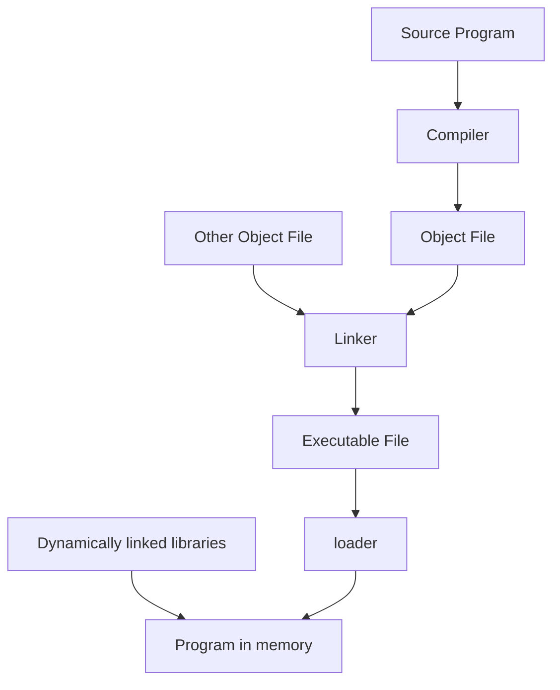

![[SOstructure.png]]
$\uparrow$ struttura di un sistema operativo.

**System call** = chiamata che un utente esegue per utilizzare funzioni in modalità protetta altrimenti non usabili.
**Flusso di comandi** = elenco di comandi e argomenti. **ES**:
```bash
sudo cp int.txt out.txt
```
**API read**:
```c
ssize_t read(int fd, void *buf, size_t count)
```
da errore!

## Modalità kernel
![[ModalitaKernel.png]]
## Librerie
**Libreria** = file che contiene funzioni già scritte.


```bash
gcc -o main main.o -lm   #crea un file chiamato main
```

Le librerie possono essere:
- **statiche**: chiamate sempre in memoria.
- **dinamiche**: chiamate in memoria solo quando il main chiama una funzione presente nella libreria.
In Windows, le librerie vengono chiamate **DLL**. e vengono chiamate dal SO con lo **stub**.
In Linux vengono chiamate **shared objects** (`.so`)
# Unix: monolitico vs modulare
Unix **monolitico** ha come kernel un unico gigante binario, che esegue tutte le funzioni.
Ciò da vari vantaggi in esecuzione, ma compilarlo diventa sempre più complicato ad ogni modifica
L'alternativa che viene adottata adesso è un kernel **modulare**, cioè diviso in varie parti, le quali eseguono ognuna una diversa funzione. 

## Microkernel
BSD e Unix sono a µkernel (creato al Carnegie Mellon):
- Rimosse fuori dal kernel le componenti NON essenziali
- µkernel Mach
- Messaggi
![[microkernel.png]]

## Apple & iOS
Basati su **Darwin**, a sua volta basato su **BSD** / Mach.
Ha 2 system-call interfaces:
- Mach system calls (dette "traps")
- BSD system calls (che danno le funzionalità POSIX).
**Mach** Offre:
- memory management
- CPU scheduling
- inter-process communication (IPC) facilities (i.e. message passing)
- remote procedure calls (RPCs)
![[darwin.png]]
$\uparrow$ struttura di Darwin