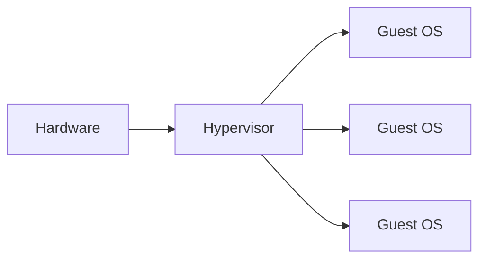
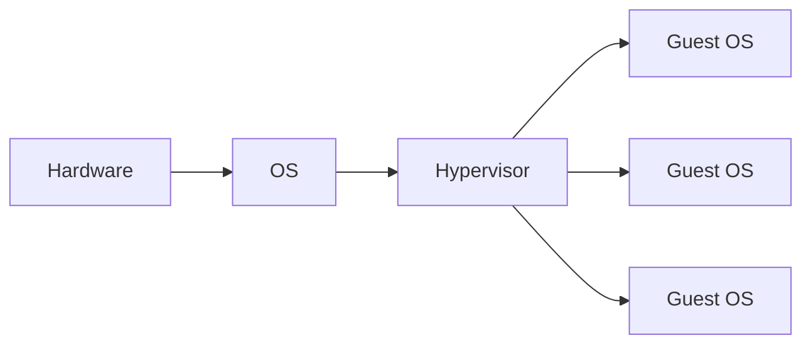

Le macchine virtuali, dette anche **HyperVisor**, sono "**programmi** che fanno girare altri programmi", astraendo dall'harware e dal SO.
Ci sono 2 tipi:
- **Tipo 1**: un software che separa hardware da SO (es: Windows 10).
  **Esempi**: VMware, Hyper-V.

**Altra definizione**:
  Un pezzo di software, firmware o hardware che dà l'impressione alle macchine ospiti (macchine virtuali) come se stessero operando su hardware fisico.
  Consente a più sistemi operativi di condividere un singolo host e il suo hardware.
  L'hypervisor gestisce le richieste delle macchine virtuali per accedere alle risorse hardware (RAM, CPU, NIC, ecc.) agendo come una macchina indipendente.
  Opera direttamente sull'hardware dell'host e può monitorare i sistemi operativi che girano sopra l'ipervisore.
  È completamente indipendente dal sistema operativo.
  L'ipervisore è di dimensioni ridotte in quanto la sua principale funzione è la condivisione e la gestione delle risorse hardware tra diversi sistemi operativi.
- **Tipo 2**: un SO "host" fornisce servizi.

